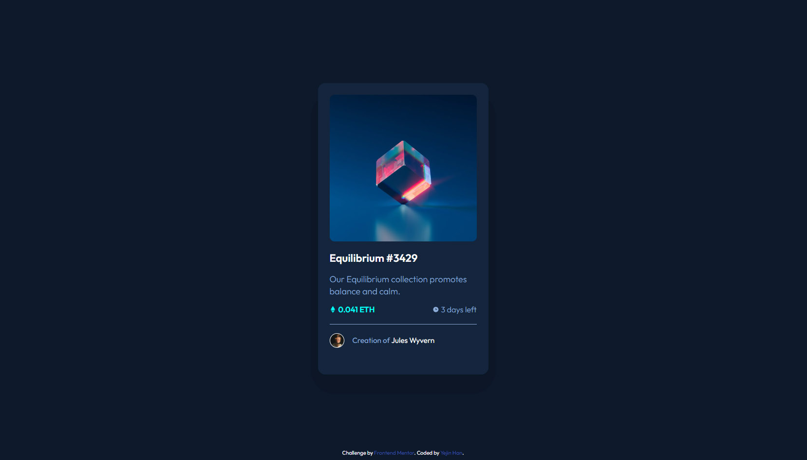

# Frontend Mentor - NFT preview card component solution

This is a solution to the [NFT preview card component challenge on Frontend Mentor](https://www.frontendmentor.io/challenges/nft-preview-card-component-SbdUL_w0U). Frontend Mentor challenges help you improve your coding skills by building realistic projects. 

## Table of contents

- [Overview](#overview)
  - [The challenge](#the-challenge)
  - [Screenshot](#screenshot)
  - [Links](#links)
- [My process](#my-process)
  - [Built with](#built-with)
  - [What I learned](#what-i-learned)
  - [Continued development](#continued-development)
  - [Useful resources](#useful-resources)
- [Author](#author)

## Overview

### The challenge

Users should be able to:

- View the optimal layout depending on their device's screen size
- See hover states for interactive elements

### Screenshot

### Links

- Solution URL: [https://github.com/Yejin-Han/NFT-preview-card-component](https://github.com/Yejin-Han/NFT-preview-card-component)
- Live Site URL: [https://yejin-han.github.io/NFT-preview-card-component/](https://yejin-han.github.io/NFT-preview-card-component/)

## My process

### Built with

- [BEM](https://getbem.com/) - Block Element Modifier
- [SCSS](https://styled-components.com/) - For styles

### What I learned

- simple SCSS grammar
- how to use BEM with SCSS

### Continued development

- I spent almost 3 hours to finish this solution. I always put too much strength on some details while building responsive designs. I have to make it faster.

### Useful resources

- [Example resource 1](https://mingmeng030.tistory.com/252) - I learned that in SCSS we can use hex code in rgba.

## Author

- Github - [Yejin Han(한예진)](https://github.com/Yejin-Han)
- Frontend Mentor - [@Yejin-Han](https://www.frontendmentor.io/profile/Yejin-Han)
